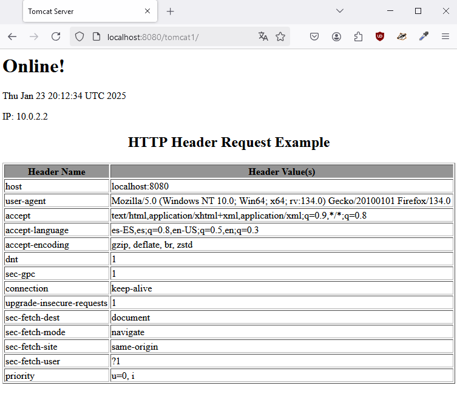
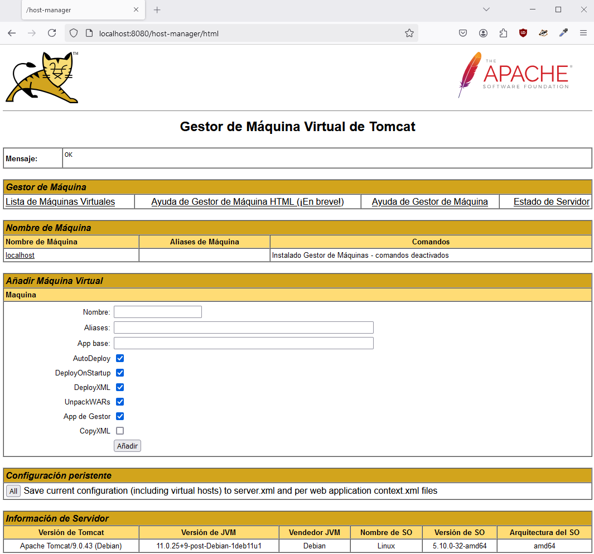

# Despliegue de una aplicación Java usando Tomcat y Maven

<br>

## Contenidos
- [Configuración inicial de la máquina](#configuración-inicial-de-la-máquina)  
- [OpenJDK](#openjdk)  
- [Tomcat](#tomcat)  
- [Administración](#administración)  
- [Despliegue manual](#despliegue-manual)  
- [Maven](#maven)
- [Extracción de archivos](#extracción-de-archivos)
- [Tarea](#tarea)  

<br>

## Configuración inicial de la máquina

Generar el Vagrantfile:  
`vagrant init debian/bullseye64`

Modificación del Vagrantfile:
```ruby
# -*- mode: ruby -*-
# vi: set ft=ruby :

Vagrant.configure("2") do |config|
  config.vm.define "practica" do |p|
    p.vm.box = "debian/bullseye64"
    p.vm.hostname = "practica"
    p.vm.network "forwarded_port", guest: 8080, host: 8080
    p.vm.network "private_network", ip: "192.168.10.10"
  end # practica
end # cofig
```

Levantamiento de la máquina:  
`vagrant up`

Conectar a la máquina por ssh:  
`vagrant ssh`

## OpenJDK

Actualización del repositorio:  
`sudo apt update`

Instalación de OpenJDK:  
`sudo apt install -y openjdk-11-jdk`

## Tomcat

Instalación:  
`sudo apt install -y tomcat9`

Creación de un grupo de usuarios para tomcat9:  
`sudo groupadd tomcat9`

Creación del usuario para el servicio:  
`sudo useradd -s /bin/false -g tomcat9 -d /etc/tomcat9 tomcat9`  
Se impide que el usuario inicie sesión en el sistema por seguridad *(-s /bin/false)*, se especifica el grupo *(-g tomcat9)*, define el directorio de inicio *(-d /etc/tomcat9)* y se le asigna un nombre *(tomcat9)*.

Arrancar el servicio:  
`sudo systemctl start tomcat9`

Comprobación del servicio:  
`sudo systemctl status tomcat9`  
Devuelve:
```bash
tomcat9.service - Apache Tomcat 9 Web Application Server
     Loaded: loaded (/lib/systemd/system/tomcat9.service; enabled; vendor preset: enabled)
     Active: active (running) since Mon 2025-01-20 11:30:54 UTC; 1min 35s ago
       Docs: https://tomcat.apache.org/tomcat-9.0-doc/index.html
    Process: 5832 ExecStartPre=/usr/libexec/tomcat9/tomcat-update-policy.sh (code=exited, status=0/SUCCESS)
   Main PID: 5836 (java)
      Tasks: 29 (limit: 510)
     Memory: 75.7M
        CPU: 12.143s
     CGroup: /system.slice/tomcat9.service
             └─5836 /usr/lib/jvm/java-11-openjdk-amd64/bin/java -Djava.util.logging.config.file=/var/lib/tomcat9/conf/logging.properties -Djava.util.logging.manager=org.apache.juli.ClassLoaderLogManager -Djava.awt.headless=t>

Jan 20 11:30:56 practica tomcat9[5836]: OpenSSL successfully initialized [OpenSSL 1.1.1w  11 Sep 2023]
Jan 20 11:30:58 practica tomcat9[5836]: Initializing ProtocolHandler ["http-nio-8080"]
Jan 20 11:30:58 practica tomcat9[5836]: Server initialization in [2718] milliseconds
```

En *http://localhost:8080*:


<br>

## Administración

Edición del archivo *tomcat-users.xml* para configurar un usuario *alumno* con acceso completo a funcionalidades administrativas y gestión del servidor Tomcat:  
`sudo nano /etc/tomcat9/tomcat-users.xml`

Se definen roles específicos y el usuario *alumno*:  
```bash
<?xml version="1.0" encoding="UTF-8"?>
<tomcat-users xmlns="http://tomcat.apache.org/xml"
              xmlns:xsi="http://www.w3.org/2001/XMLSchema-instance"
              xsi:schemaLocation="http://tomcat.apache.org/xml tomcat-users.xsd"
              version="1.0">
  <role rolename="admin"/>
  <role rolename="admin-gui"/>
  <role rolename="manager"/>
  <role rolename="manager-gui"/>
  <user username="alumno"
        password="1234"
        roles="admin,admin-gui,manager,manager-gui"/>
</tomcat-users>
```

Roles:  
- admin: Permite realizar tareas administrativas.
- admin-gui: Habilita el acceso a la interfaz gráfica de administración.
- manager: Da permisos para gestionar aplicaciones.
- manager-gui: Permite utilizar la interfaz gráfica de gestión de aplicaciones.

Instalación del administrador web y el administrador de Tomcat para incluir interfaces de administración (*Admin GUI*) y gestión (*Manager GUI*):  
`sudo apt install -y tomcat9-admin`

Acceso a los paneles de administración:

1. *http://localhost:8080/manager/html*




<br><br>

2. *http://localhost:8080/host-manager/html*




<br><br>

Para permitir el acceso remoto a todos los paneles, se modifica el fichero *context.xml* del directorio */usr/share/tomcat9-admin/host-manager/META-INF/* con el siguiente contenido:

```bash
<?xml version="1.0" encoding="UTF-8"?>
<Context antiResourceLocking="false" privileged="true" >
  <CookieProcessor  className="org.apache.tomcat.util.http.Rfc6265CookieProcessor"
                    sameSiteCookies="strict" />
  <Valve  className="org.apache.catalina.valves.RemoteAddrValve"
          allow="\d+\.\d+\.\d+\.\d+" />
  <Manager sessionAttributeValueClassNameFilter="java\.lang\.(?:Boolean|Integer|Long|Number|String)|org\.apache\.catalina\.filters\.CsrfPreventionFilter\$LruCache(?:\$1)?|java\.util\.(?:Linked)?HashMap"/>
</Context>
```

La línea de *Valve* se encarga de restringir el acceso según la IP del cliente, por lo que en este caso se modifica para que permita el acceso desde todas las direcciones IP.

Recarga de servidor:  
`sudo systemctl restart tomcat9`

## Despliegue manual

En el *Gestor de Aplicaicones Web* *(http://localhost:8080/manager/html)*, en la sección *Desplegar*, en el apartado *Archivo War a desplegar*, se pulsa sobre *Examinar...* y se selecciona el fichero *tomcat1.war*.

Tras esto, se pulsa en *Desplegar* y la aplicación ya aparecerá listada en la sección *Aplicaciones*.


<br><br>

## Maven

Instalación:  
`sudo apt-get update && sudo apt-get -y install maven`

Comprovar que se ha instalado correctamente viendo la versión:
`mvn --v`

### Configuración

En */etc/tomcat9/tomcat-users.xml* añadimos los roles *manager-status, manager-script* y *manager-jmx* y un nuevo usuario *despliegue* (no se utiliza el usuario *alumno* por seguridad):  
`sudo nano /etc/tomcat9/tomcat-users.xml`
```bash
<?xml version="1.0" encoding="UTF-8"?>
<tomcat-users xmlns="http://tomcat.apache.org/xml"
              xmlns:xsi="http://www.w3.org/2001/XMLSchema-instance"
              xsi:schemaLocation="http://tomcat.apache.org/xml tomcat-users.xsd"
              version="1.0">
  <role rolename="admin"/>
  <role rolename="admin-gui"/>
  <role rolename="manager"/>
  <role rolename="manager-gui"/>
  <role rolename="manager-status"/>
  <role rolename="manager-script"/>
  <role rolename="manager-jmx"/>
  <user username="alumno"
        password="1234"
        roles="admin,admin-gui,manager,manager-gui"/>
  <user username="despliegue" password="5678" roles="manager-script"/>
</tomcat-users>
```

Tras esto, se edita el archivo */etc/maven/settings.xml*, dentro del bloque *servers* para indicar a Maven un identificador y las credenciales del servidor para desplegar.  
`sudo nano /etc/maven/settings.xml`

```bash
<servers>
  <server>
    <id>Tomcat</id>
    <username>despliegue</username>
    <password>5678</password>
  </server>
</servers>
```

Ahora, se generará una aplicación en el directorio personal:  
`cd`  
```bash
mvn archetype:generate -DgroupId=org.zaidinvergeles \
                        -DartifactId=test-app \
                        -DarchetypeArtifactId=maven-archetype-webapp \
                        -DinteractiveMode=false
```


Desplazamiento al directorio *test-app*, creado por el proceso anterior:  
`cd test-app`

Modificación del POM del proyecto, en la sección *build* para que se utilice el plugin de Maven en el despliegue:  
`sudo nano pom.xml`

```bash
<project  xmlns="http://maven.apache.org/POM/4.0.0"
          xmlns:xsi="http://www.w3.org/2001/XMLSchema-instance"
          xsi:schemaLocation="http://maven.apache.org/POM/4.0.0 http://maven.apache.org/maven-v4_0_0.xsd">
  <modelVersion>4.0.0</modelVersion>
  <groupId>org.zaidinvergeles</groupId>
  <artifactId>test-app</artifactId>
  <packaging>war</packaging>
  <version>1.0-SNAPSHOT</version>
  <name>test-appt Maven Webapp</name>
  <url>http://maven.apache.org</url>
  <dependencies>
    <dependency>
      <groupId>junit</groupId>
      <artifactId>junit</artifactId>
      <version>3.8.1</version>
      <scope>test</scope>
    </dependency>
  </dependencies>
  <build>
    <finalName>test-app-deployment</finalName>
    <plugins>
      <plugin>
        <groupId>org.apache.tomcat.maven</groupId>
        <artifactId>tomcat7-maven-plugin</artifactId>
        <version>2.2</version>
        <configuration>
          <url>http://localhost:8080/manager/text</url>
          <server>Tomcat</server>
          <path>/despliegue</path>
        </configuration>
      </plugin>
    </plugins>
  </build>
</project>
```

De esta forma, *finalName* es el nombre del .jar que se generará, *url* del servidor Tomcat, *server* indica el nombre del servidor y *path* es el nombre que la aplicación utilizará en el path de la URL.

Por último, los comandos utilizados en Maven para desplegar son:  
`mvn tomcat7:deploy`  
`mvn tomcat7:redeploy`  
`mvn tomcat7:undeploy`


Una vez desplegada, se puede acceder a la aplicación en:  
`http://localhost:8080/despliegue`


<br>

## Extracción de archivos

Viendo que todo ha funcionado correctamente, se procede a extraer los archivos necesarios para crear la provisión de forma completa.
`sudo cp /etc/tomcat9/tomcat-users.xml /vagrant`
`sudo cp /usr/share/tomcat9-admin/host-manager/META-INF/context.xml /vagrant`
`sudo cp /etc/maven/settings.xml /vagrant`
`sudo cp /home/vagrant/test-app/pom.xml /vagrant`

### Actualización de Vagrantfile

## Tarea